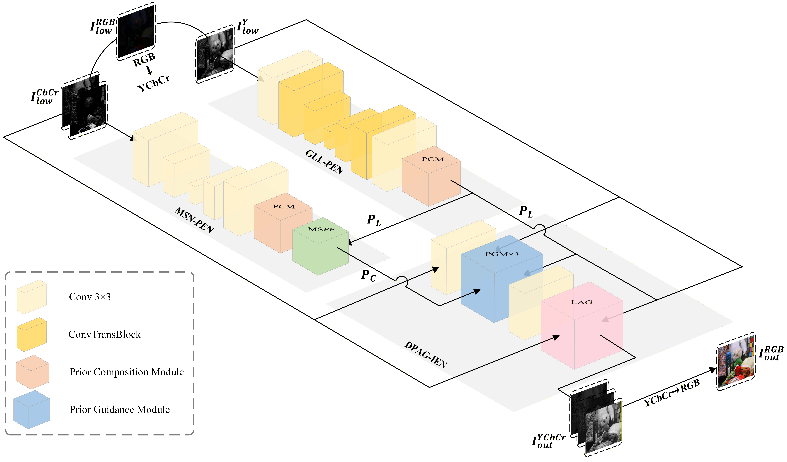

# Dual Prior Adaptive Guidance for Non-uniform Low-Light Image Enhancement (DPAGNet)

## 🎥 Demo

<table border="0">
  <tr>
    <td width="100%"></td>
  </tr>
</table>

---

## 📖 Introduction

In this work, we propose a **Dual Prior Adaptive Guidance Network (DPAGNet)** for non-uniform low-light image enhancement. DPAGNet adaptively adjusts both the strength of the noise prior and the magnitude of the enhancement residual according to the local luminance condition.

<p align="center">
  
</p>

DPAGNet contains three main components:

* A **Global-Local Luminance Prior Extraction Network (GLL-PEN)** that combines local structure modeling with global context modeling to extract a reliable luminance-channel darkness-noise prior.
* A **Multi-Strength Noise Prior Extraction Network (MSN-PEN)** with a **Multi-Strength Prior Fusion (MSPF)** module that produces weak, medium, and strong noise priors and adaptively fuses them according to regional luminance conditions.
* A **Dual Prior Adaptive Guided Image Enhancement Network (DPAG-IEN)** that progressively restores the image using darkness and noise priors. Its **Luminance-Aware Gate (LAG)** spatially modulates the candidate enhancement residual to protect normally exposed and bright regions.

---

## 🛠️ Installation

### Create a conda environment

```bash
conda create -n DPAGNet python=3.10.20
conda activate DPAGNet
```

### Install the main packages

```bash
pip install torch==2.10.0+cu126
pip install numpy==2.2.5 tqdm==4.67.3 pandas==2.3.3
```

### Clone DPAGNet

```bash
git clone https://github.com/tomorrowaa/DPAGNet.git
cd DPAGNet
```

---

## 💻 Usage

### Prepare Datasets

#### Download datasets

Create the folder to place datasets.

```bash
mkdir datasets
```

The LOL dataset can be downloaded from [Baidu Disk](https://pan.baidu.com/share/init?surl=ABMrDjBTeHIJGlOFIeP1IQ) (code: acp3).

### Test
#### Prepare pretrained models

Create the folder to place pretrained models.

```bash
mkdir pretrained_models
```
The pretrained DPAGNet models and test results on LOL and MIT FiveK datasets can be downloaded from [Baidu Disk](https://pan.baidu.com/s/1zVi6mFl_UeMYYMNm3iLyHA) (code: wjzh).

Put the downloaded pretrained models to `pretrained_models/`

#### Test on the paired datasets

```bash
python test.py 
```
#### Test on the unpaired datasets

```bash
python test_unpair.py
```

### Train
#### Train on the paired datasets

```bash
python train_denoise.py
```

---

## 🙏 Acknowledgements

Special thanks to the editors and anonymous reviewers for their time, valuable comments, and insightful suggestions that greatly improved this paper.
